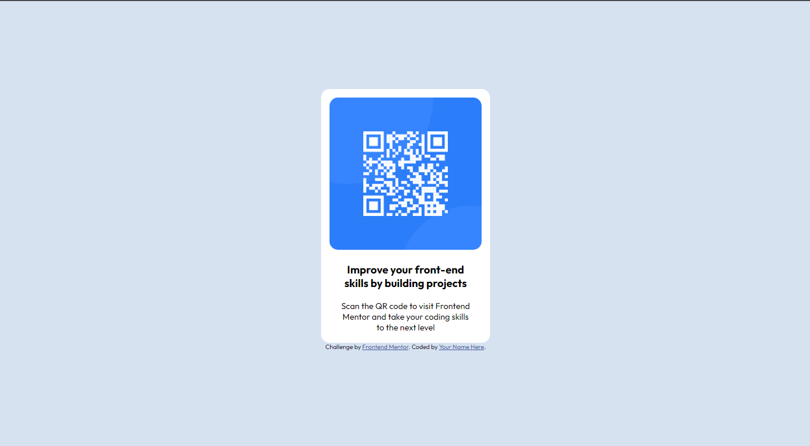

# Frontend Mentor - QR code component solution

This is a solution to the [QR code component challenge on Frontend Mentor](https://www.frontendmentor.io/challenges/qr-code-component-iux_sIO_H). Frontend Mentor challenges help you improve your coding skills by building realistic projects. 

## Table of contents

- [Overview](#overview)
  - [Screenshot](#screenshot)
  - [Links](#links)
- [My process](#my-process)
  - [Built with](#built-with)
  - [Continued development](#continued-development)
- [Author](#author)

## Overview

### Screenshot

### Links

- Site - https://mohamdah.github.io/QRCodeComponent/

## My process

### Built with

- Semantic HTML5 markup
- SASS preprocessor
- Flexbox

### Continued development

This is my first time using SASS and it's pretty awesome. I'm very rusty in css as a whole so I gotta improve on that. This project didn't have anything complicated so nothing much yet.

## Author

- Frontend Mentor - [@MohamDah](https://www.frontendmentor.io/profile/MohamDah)
- Twitter - [@MohamIsMe](https://www.twitter.com/MohamIsMe)

